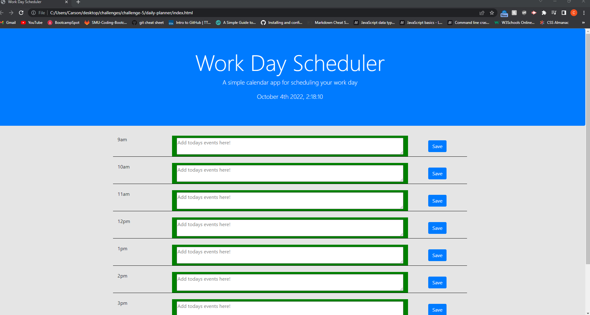

# Media Suggestor

#### By Carson Loser

#### This application is designed for a given user to add their daily events to a planner

# Prerequisites

* When the user opens the application, they are able to see the current date and time above, and a planner below with typical work day hours.

* The given hour time blocks are color coded to represent past, present, and future times.

* When the user clicks into a specific time block, they are able to type out an event and click the save button.

* When the save button is clicked, the information inputted will be saved to local storage.

* When the user refreshes the page, their saved events are displayed as a list on screen.

# Live Server URL

* https://carson-loser.github.io/

# Image of live application

The following image demonstrates the web application's appearance and functionality:

